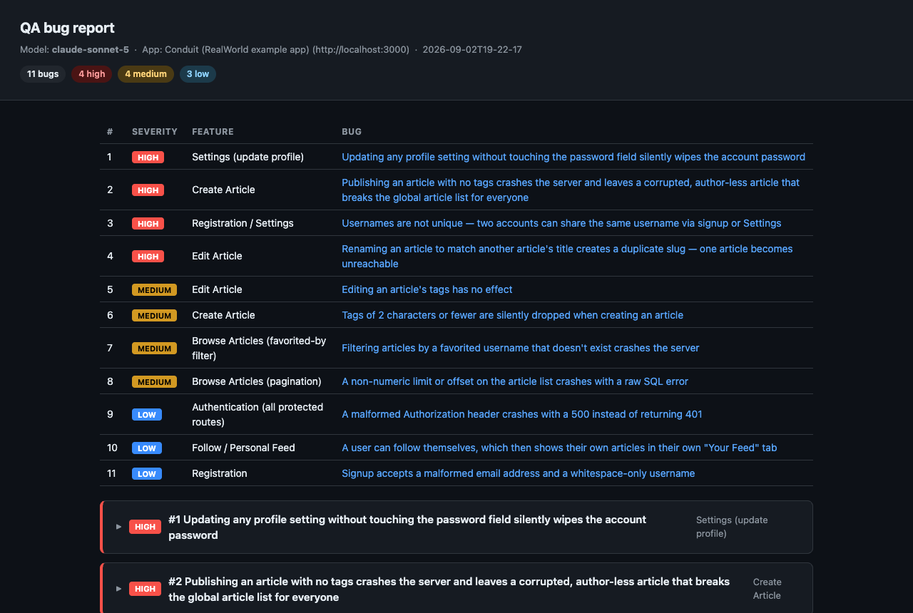
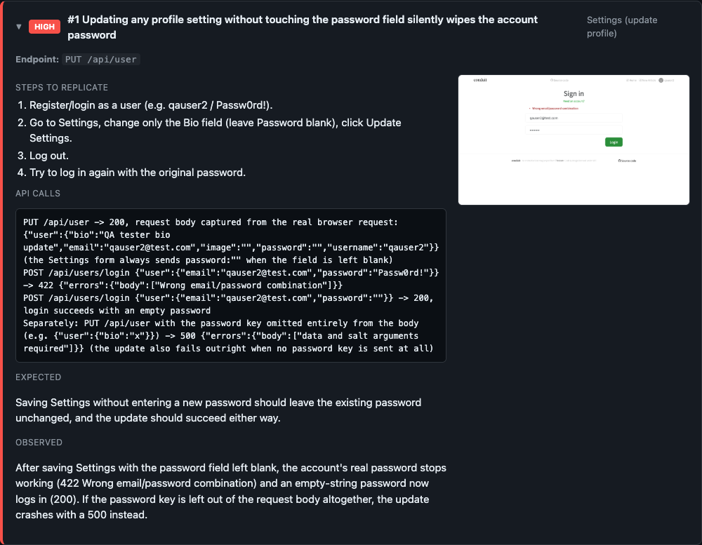
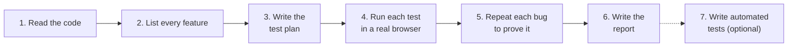

<div align="center">

# ai-qa-engineer

**An AI agent that tests your website like a QA engineer, and reports only the bugs it can prove.**

[](LICENSE)
[](https://playwright.dev)
[](#key-features)

[Live example report](https://jpita.github.io/ai-qa-engineer/examples/conduit/bug-report-2026-09-02T19-22-17-claude-sonnet-5.html) · [How it works](#how-it-works) · [Quickstart](#quickstart) · [Evaluate agents](#evaluate-agents)

</div>

## What it does

You give it two things:

- a website that is running
- the website's code

It gives you back:

1. **A test plan.** Every test case, with steps, the expected result and a risk level.
2. **A bug report.** Every bug, with steps to make it happen again, a screenshot and the server calls.
3. **A coverage list.** Every server route, and whether it was tested.
4. **Automated tests, when you ask.** Playwright or Cypress tests, your choice, for every bug and every high-risk test case, so you can run them again after every change.

The repo also includes an evaluation of the agent itself: can it prove persistence and calculation bugs, and correctly recognize their fixed versions? Run it locally or in Docker with [Harbor](docs/HARBOR.md).

[](https://jpita.github.io/ai-qa-engineer/examples/conduit/bug-report-2026-09-02T19-22-17-claude-sonnet-5.html)

## Key features

- **Tests like a person.** It clicks and types in a real browser, not only in code.
- **Proves every bug.** It reports a bug only after it makes the bug happen a second time.
- **Covers everything.** It counts every feature in the code and says which ones it could not test.
- **Tries to break things.** Empty fields, wrong values, duplicates, page reloads.
- **Writes automated tests.** In Playwright or Cypress. It turns bugs and high-risk cases into tests, runs them, and sorts every failure: app bug, test bug, setup problem, or not enough evidence. [See 39 example tests](examples/juice-shop/specs).
- **Works with any AI agent.** Claude Code, Codex, Grok, Kimi, DeepSeek, Antigravity and Copilot.
- **Checks the tester.** A repeatable broken/fixed task scores the agent's diagnosis, browser evidence and findings. Harbor runs each trial in a fresh container and provides a results viewer.

## Example: 11 bugs in a demo blog

I ran it on [Conduit](https://github.com/TonyMckes/conduit-realworld-example-app), a public demo blog that developers use for practice.

It tested all 21 server routes and found 11 bugs. The 4 most serious:

1. Save your profile with the password box empty, and your password stops working.
2. Publish an article with no tags, and the site crashes for every user.
3. Two people can sign up with the same username.
4. Rename an article to the title of another article, and one of them can no longer be opened.

Each bug in the report looks like this. [Open the full report](https://jpita.github.io/ai-qa-engineer/examples/conduit/bug-report-2026-09-02T19-22-17-claude-sonnet-5.html).



## How it works



1. **Read the code.** The screens and the server behind them.
2. **List every feature.** This list is the target. Anything not tested is named in the report.
3. **Write the test plan.** One test case per thing to check: normal use, wrong input, edge cases.
4. **Run each test.** In a real browser, like a user. Each case is marked pass or fail.
5. **Prove each bug.** Make it happen again, then save a screenshot and the server calls.
6. **Write the report.** One web page: the test plan with results, then every bug in detail.
7. **Write automated tests (optional).** Playwright or Cypress tests for each bug and each high-risk case. It runs them with no retries and gives each failure a verdict with evidence.

It looks for features that do not work. It is not a security scanner.

## Quickstart

1. **Install.**

   ```bash
   git clone https://github.com/jpita/ai-qa-engineer.git
   cd ai-qa-engineer
   npm install
   npx playwright install chromium
   ```

2. **Give your agent a browser.**

   ```bash
   claude mcp add playwright -- npx -y @playwright/mcp@latest --headless --isolated
   ```

3. **Add the skill to Claude Code.**

   ```bash
   mkdir -p ~/.claude/skills/ai-qa-engineer
   ln -s "$PWD/SKILL.md" ~/.claude/skills/ai-qa-engineer/SKILL.md
   ```

4. **Run it.** Point it at the website and its code. Each one can be local or a link.

   ```
   /ai-qa-engineer --url http://localhost:3000 --source ./conduit
   ```

   To also get automated tests, name the framework: `--tests playwright` or `--tests cypress`.

   ```
   /ai-qa-engineer --url http://localhost:3000 --source ./conduit --tests cypress
   ```

   If you ask for tests without naming a framework, it uses the one the app's repo already has, or Playwright.

   With only a code link, it downloads the code, starts the site, then tests it:

   ```
   /ai-qa-engineer --source https://github.com/juice-shop/juice-shop
   ```

5. **Open the report.** It is the `bug-report-<date>-<model>.html` file in the folder you ran it from.

Using another agent? Paste [SKILL.md](SKILL.md) into its prompt. Setup for each agent is in the [full guide](docs/QUICKSTART.md).

> [!WARNING]
> The agent runs with your permissions on your computer.
>
> Test a throwaway app, or [sandbox the agent](docs/SANDBOX-MACOS.md).

## Evaluate agents

Two synthetic tasks check the agent itself:

- **Profile persistence:** prove that a saved bio survives a reload.
- **Silent calculation:** check a match score independently when list and text inputs should give the same answer—even if every request succeeds.

Each task has broken and fixed variants with fresh state. Passing requires the correct conclusion, recorded browser activity, matching findings and a screenshot. The default demo runs all four trials; add `-- --task calculation` to run only the new task.

After installing the repo dependencies and Playwright Chromium, try the scripted reference:

```bash
npm run eval:demo
```

Open the printed `report.html` path to inspect scores, timings and evidence. This calls no model; a passing demo verifies the evaluation machinery, not AI performance.

| Workflow | Command | Guide |
| --- | --- | --- |
| Evaluate a local agent CLI | `npm run eval:run -- --agent NAME --model ID --command 'COMMAND'` | [Local eval setup and scoring](docs/EVALS.md) |
| Check the Docker tasks without model calls | `npm run harbor:oracle` and `npm run harbor:nop` | [Harbor setup](docs/HARBOR.md#setup) |
| Compare Claude Code and Codex in Docker | `npm run harbor:compare` | [Authentication and comparison options](docs/HARBOR.md#compare-agents) |
| Browse Harbor jobs, evidence and timings | `npm run harbor:view` | [Reading Harbor results](docs/HARBOR.md#results-and-timing) |

Harbor requires its own installation and a working Docker environment. Its comparison defaults to three attempts per task and state for each agent: 24 trials. Local eval output goes to `runs/evals/`; Harbor tasks and jobs go to `runs/harbor/`. Both are ignored by Git.

These measure two focused QA behaviors. It does not yet score full-site coverage, report quality or generated regression tests, and is not a broad ranking of QA agents.

## What is in this repo

| Folder | What it is |
| --- | --- |
| [`SKILL.md`](SKILL.md) | The instructions the AI agent follows. The core of the project. |
| [`scripts/`](scripts) | Helper code: builds the report, scans the website, checks coverage. |
| [`scripts/evals/`](scripts/evals) | Broken/fixed fixture, browser reference, grader, local runner and Harbor task generator. |
| [`tests/`](tests) | Automated checks for coverage logic, eval grading, fixture behavior and timing summaries. |
| [`examples/`](examples) | Two real runs, with all their output. |
| [`docs/`](docs) | Setup, evaluation, Harbor and sandbox guides. |

## Files a full QA run writes

These are the full-site skill outputs. Focused evals use the smaller [eval artifact contract](docs/EVALS.md#trial-artifacts).

| File | What is in it |
| --- | --- |
| `test-plan.json` | every test case: steps, expected result, risk, result |
| `findings.json` | every bug: steps, expected and actual result, server calls, screenshot |
| `coverage.json` | every server route: tested or not, and why |
| `bug-report-<date>-<model>.html` | the report, one file with the screenshots inside |
| `specs/` or `cypress/e2e/` | the Playwright or Cypress tests (only when you ask for automated tests) |
| `triage.json` | a verdict and evidence for each failed test (same) |

## Examples

| Run | What it shows |
| --- | --- |
| [Conduit](examples/conduit) | a full run: 11 bugs, 21 routes, the [report](https://jpita.github.io/ai-qa-engineer/examples/conduit/bug-report-2026-09-02T19-22-17-claude-sonnet-5.html) with screenshots |
| [OWASP Juice Shop](examples/juice-shop) | an early run on 10 of 102 routes: a 39-case test plan, generated Playwright tests, and a review of each failed test |

<details>
<summary><b>Design decisions</b> (for engineers)</summary>

<br>

**Code does the mechanical work. The agent does the judgment.**

| Code | The agent |
| --- | --- |
| scan the website, record its buttons and requests | read the code, find every server route |
| match the scan to the routes | write the test plan |
| run the tests, read the results | write tests at the right level |
| build the report | decide which failures are real bugs |
| check every output file against a schema | |

**Three test levels.**

| Level | What it does | Best for |
| --- | --- | --- |
| `api` | calls the server directly | bad data, missing fields, wrong types |
| `ui` | drives a real browser on the real server | what a user actually does |
| `ui_mocked` | drives the browser, fakes the server reply | server errors, empty lists, broken replies |

- A feature with a screen is tested both in the browser and directly on the server. A passing server call does not prove the screen sends that call.
- Each failed test gets one of four verdicts: app bug, test bug, setup problem, or not enough evidence.
- No automatic retries. A test that passes only on retry is itself a finding.
- No made-up timeouts. A wait time is raised only with a measured number.
- No guesses. If the code does not show a rule, the report says so.

</details>

## Docs

- [Evaluation guide](docs/EVALS.md): local runs, output contract, grading, scores and timing
- [Harbor guide](docs/HARBOR.md): Docker setup, authentication, agent comparisons and results viewer
- [Full setup guide](docs/QUICKSTART.md): every agent, test apps, comparing agents
- [Sandbox guide](docs/SANDBOX-MACOS.md): keep an agent away from your passwords and keys (macOS)
- [SKILL.md](SKILL.md): the full instructions the agent follows

## License

MIT
