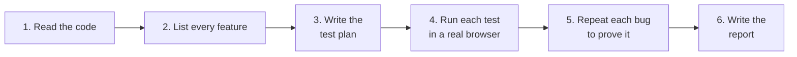

# ai-qa-engineer

**An AI agent that does the job of a QA engineer: it tests a website and writes up every bug it finds.**

## What it does, in plain words

Before a website goes live, a QA engineer checks that every feature works.

They click through every screen, try wrong input on purpose, and write a report for each bug they find.

This project gives that job to an AI coding agent, such as Claude Code.

You give it a website and the website's code.

It finds every feature in the code, writes a test plan, runs every test case the way a person would, and gives you a report.

It reports a bug only after it makes the bug happen again, so the report has no guesses.

## Example: 11 real bugs in a demo blog site

I ran it on [Conduit](https://github.com/TonyMckes/conduit-realworld-example-app), a public demo blog site that developers use for practice.

It found 11 bugs. The four most serious:

- If you save your profile and leave the password box empty, your password stops working.
- If you publish an article with no tags, the site crashes and the article list breaks for every user.
- Two people can sign up with the same username.
- If you rename an article to the same title as another article, one of them can no longer be opened.

[](examples/conduit)

Each bug in the report has the steps to make it happen again, what should happen, what happens instead, and a screenshot:


## How it works



1. **Read the code.** It reads the code for the screens and for the server behind them.
2. **List every feature.** It makes a full list, so it knows what "done" means and can say what it did not test.
3. **Write the test plan.** One test case per thing to check, with steps, the expected result and a risk level. It covers normal use, empty fields, wrong values and duplicates.
4. **Run each test.** It opens a real browser, clicks and types like a user, and marks each test case pass or fail.
5. **Prove each bug.** It keeps a bug only if it can make it happen again, and saves a screenshot.
6. **Write the report.** One web page: the test plan with each result, then full detail for each bug.

## What is in this repo

| Part | What it is |
| --- | --- |
| [`SKILL.md`](SKILL.md) | The instructions the AI agent follows. Plain English. This is the core of the project. |
| [`scripts/`](scripts) | Helper code: builds the bug report, scans the website, checks which features were tested. |
| [`examples/`](examples) | Two real runs, with all their output. |
| [`docs/`](docs) | Setup guides. |

It works with 7 AI agents: Claude Code, Codex, Grok, Kimi, DeepSeek, Antigravity and Copilot.

The same instructions go to each one, so you can compare which agent finds the most bugs.

---

*The rest of this page is for engineers who want to run it.*

## Quickstart

```bash
git clone https://github.com/jpita/ai-qa-engineer.git
cd ai-qa-engineer
npm install
npx playwright install chromium
```

Link the skill into Claude Code:

```bash
mkdir -p ~/.claude/skills/ai-qa-engineer
ln -s "$PWD/SKILL.md" ~/.claude/skills/ai-qa-engineer/SKILL.md
```

Run it. The app and the source can each be local or remote:

```
/ai-qa-engineer --url http://localhost:3000 --source ./conduit
/ai-qa-engineer --source https://github.com/juice-shop/juice-shop   # clones, boots, then tests
```

Other agents: paste [SKILL.md](SKILL.md) into the prompt.

Full setup, including the Playwright browser: [Quickstart](docs/QUICKSTART.md).

> [!WARNING]
> The agent runs with your shell and your permissions.
>
> Run it against a throwaway app, or [sandbox it](docs/SANDBOX-MACOS.md).

## What a run writes

- `test-plan.json`: every test case, with steps, expected result, risk level and the result.
- `findings.json`: one entry per bug, with steps, expected and actual result, API calls and screenshot.
- `coverage.json`: one row per backend route, with the result or the reason it was not tested.
- `bug-report-<timestamp>-<model>.html`: the report, one file with the screenshots inside.

Scope is functional bugs: wrong results, lost data, crashes, bad error handling.

It is not a security scanner.

## Design decisions

**Code for the mechanical work, the agent for judgment.**

| Code | The agent |
| --- | --- |
| crawl the app, record its elements and requests | read the source, find the real API surface |
| join the crawl and the API into a coverage map | rank what to test |
| run the suite, parse the results | write tests at the right layer |
| render the report | decide which failures are real bugs |
| validate every output against a schema | |

An LLM doing the crawl is slow and unreliable.

Code doing the triage gives you the noise most generated test suites are made of.

**Three test layers.**

| Layer | What it does | Best for |
| --- | --- | --- |
| `api` | calls the endpoint directly | bad payloads, missing fields, wrong types |
| `ui` | drives the real browser on the real backend | the flows a user actually does |
| `ui_mocked` | drives the browser, fakes the response | a 500, an empty list, a malformed body |

Every endpoint with a screen in front of it is tested at both the API and the UI layer.

If the plan covers only one, the report says so.

**Triage has four answers.** Each failure is one of: app broken, test broken, environment not ready, or not enough evidence.

Each gets a verdict, the evidence and a confidence level.

`inconclusive` is a valid answer.

**No retries, no invented timeouts.** A retry hides the signal triage needs. A timeout is raised only with a measured number.

**Gaps are reported, not guessed.** If the source does not show whether a field is validated, the report says so.

## Examples

| | What it shows |
| --- | --- |
| [`examples/conduit/`](examples/conduit) | a full skill run: 11 bugs, 21 routes, the HTML report with screenshots |
| [`examples/juice-shop/`](examples/juice-shop) | the script pipeline on [OWASP Juice Shop](https://github.com/juice-shop/juice-shop): UI map, API surface, test plan, generated Playwright specs, triage. An early run: 10 of 102 routes |

## Docs

- [Quickstart](docs/QUICKSTART.md): wire a browser, start a target app, run it, compare agents
- [Sandboxing agents](docs/SANDBOX-MACOS.md): keep an agent away from your credentials on macOS
- [SKILL.md](SKILL.md): the full instructions the agent follows

## License

MIT
